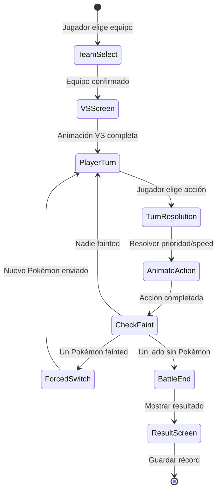

# PokeAPI - Brief del Producto

## 1. Resumen Ejecutivo

### Qué es
Un juego de batallas Pokémon por turnos con estética retro GBA, construido con Kotlin Multiplatform y Compose Multiplatform para Android e iOS. El jugador arma equipos de 6 Pokémon del catálogo Gen I-III (386 Pokémon) y se enfrenta a entrenadores CPU predefinidos en un sistema de combate basado en tipos, stats y movimientos.

### Propuesta de Valor
La experiencia nostálgica de las batallas Pokémon clásicas en una app nativa moderna, con datos reales de PokéAPI, funcionamiento completamente offline y la fidelidad visual de la era Game Boy Advance.

### Público Objetivo

**Primario:**
- Fans de Pokémon que crecieron con la era GBA (Gen III) y buscan nostalgia
- Jugadores casuales que quieren batallas rápidas sin necesidad de completar un RPG

**Secundario:**
- Desarrolladores que exploran el proyecto como referencia técnica de KMP
- Jugadores competitivos casuales que disfrutan optimizar equipos contra la CPU

---

## 2. Objetivos V1.0

### Funcionalidades a Entregar

**Catálogo y Datos Pokémon**
- Sync inicial desde PokéAPI → base de datos local (Room)
- Catálogo completo de 386 Pokémon con stats, tipos, sprites y movimientos
- Tabla de ventajas/desventajas de tipos
- Pokédex navegable con búsqueda y filtros por tipo/generación

**Armado de Equipo**
- Selección de 6 Pokémon para formar un equipo
- Asignación de 4 movimientos por Pokémon (del pool de movimientos que aprende)
- Definición de nivel del equipo (para escalar stats)
- Guardado de múltiples equipos

**Sistema de Batalla por Turnos**
- Combate 1v1 (un Pokémon activo por lado, con opción de cambiar)
- Selección de movimiento por turno: Luchar / Cambiar Pokémon
- Cálculo de daño basado en: poder del movimiento, stats de ataque/defensa, ventaja de tipo, STAB (Same Type Attack Bonus), factor aleatorio
- Clasificación physical vs special por movimiento
- Sistema de PP (Power Points) por movimiento
- Orden de turno determinado por stat Speed
- Condición de victoria: derrotar los 6 Pokémon del oponente

**Entrenadores CPU**
- Set predefinido de entrenadores con equipos curados temáticamente
- Niveles de dificultad progresiva (entrenadores más fuertes con mejores equipos/movimientos)
- AI básica de selección de movimientos (priorizar ventaja de tipo, no usar movimientos sin PP)
- Organización tipo "liga": entrenadores agrupados en tiers o rondas

**Registro y Récords**
- Historial de batallas: fecha, oponente, resultado, equipo usado
- Estadísticas globales: victorias/derrotas, racha actual, mejor racha
- Récord por entrenador CPU (veces enfrentado, veces ganado)

**Offline-First**
- Primera ejecución: descarga y persiste datos desde PokéAPI
- Indicador de progreso durante sync inicial
- Toda funcionalidad disponible sin conexión después del sync
- Opción manual de re-sync para actualizaciones

---

## 3. Entidades del Sistema

### Pokemon
Representa un Pokémon del catálogo nacional (datos de PokéAPI).

- Campos: pokedex_number, name, sprite_url, sprite_local_path, type_primary, type_secondary (nullable), base_hp, base_attack, base_defense, base_sp_attack, base_sp_defense, base_speed, generation
- Relaciones: tiene muchos PokemonMove (pool de movimientos aprendibles)

### Move
Un movimiento/ataque que puede usar un Pokémon.

- Campos: move_id, name, type, category (physical/special), power (nullable para status moves), accuracy, pp, priority
- Relaciones: muchos Pokémon pueden aprender un mismo Move

### PokemonMove (tabla intermedia)
Relación entre Pokémon y los movimientos que puede aprender.

- Campos: pokemon_id, move_id, learn_method
- Relaciones: pertenece a Pokemon, pertenece a Move

### TypeEffectiveness
Tabla de multiplicadores de daño entre tipos.

- Campos: attacking_type, defending_type, multiplier (0, 0.5, 1, 2)
- Relaciones: referencia a sí misma (tipo vs tipo)

### Team
Un equipo guardado por el jugador.

- Campos: team_id, name, created_at, updated_at
- Relaciones: tiene exactamente 6 TeamMember

### TeamMember
Un Pokémon dentro de un equipo, con su configuración.

- Campos: team_member_id, team_id, pokemon_id, slot (1-6), level, move_1_id, move_2_id, move_3_id, move_4_id
- Relaciones: pertenece a Team, referencia a Pokemon, referencia a 4 Move

### Trainer
Un entrenador CPU oponente.

- Campos: trainer_id, name, sprite_key, difficulty_tier, team_pokemon (JSON o relación con configuración de equipo), ai_strategy
- Relaciones: tiene un equipo predefinido de 1-6 Pokémon con movimientos asignados

### BattleRecord
Registro histórico de una batalla completada.

- Campos: record_id, trainer_id, player_team_id, result (win/loss), turns_count, date, pokemon_remaining (cuántos le quedaron al jugador)
- Relaciones: pertenece a Trainer, referencia a Team

### PlayerStats
Estadísticas agregadas del jugador (singleton).

- Campos: total_wins, total_losses, current_streak, best_streak, total_battles
- Relaciones: calculado a partir de BattleRecord

---

## 4. Roles y Permisos

| Rol | Permisos |
|-----|----------|
| player | Único rol. Acceso completo: navegar Pokédex, crear/editar equipos, iniciar batallas, ver récords. No hay autenticación ni multi-usuario. |

---

## 5. Flujos Principales

### Flujo: Primer Lanzamiento (Initial Sync)

1. Usuario abre la app por primera vez
2. App detecta base de datos vacía
3. Muestra pantalla de sync con barra de progreso y mensaje temático
4. Descarga datos en orden: Pokémon (386) → Moves → PokemonMoves → TypeEffectiveness
5. Sprites se descargan y almacenan localmente
6. Al completar, transiciona al menú principal
7. Si falla mid-sync: permite reintentar, datos parciales se mantienen

**Reglas de Negocio:**
- El sync es bloqueante — no se puede usar la app sin datos
- Los sprites se descargan en resolución baja (sprite front_default) para optimizar espacio
- Se filtran solo movimientos con power > 0 o que sean relevantes para batalla (excluir HMs de campo, moves de concurso, etc.)

### Flujo: Armado de Equipo

1. Jugador accede a "Mis Equipos"
2. Crea nuevo equipo o edita existente
3. Selecciona slot (1-6) → abre selector de Pokémon
4. Navega/busca en la Pokédex → selecciona Pokémon
5. Elige 4 movimientos del pool de movimientos del Pokémon
6. Define nivel del Pokémon (slider o input numérico)
7. Repite para los 6 slots
8. Guarda equipo con nombre personalizado

**Reglas de Negocio:**
- Un equipo requiere mínimo 1 Pokémon, máximo 6
- No se puede repetir Pokémon en el mismo equipo
- Cada Pokémon debe tener entre 1 y 4 movimientos asignados
- El nivel válido es 1-100, default 50
- Stats se calculan con fórmula simplificada basada en base stats + nivel (sin EVs/IVs)

### Flujo: Batalla

1. Jugador elige "Batalla" → ve lista de entrenadores organizados por dificultad
2. Selecciona entrenador oponente
3. Selecciona cuál de sus equipos guardados usar
4. Pantalla de VS: muestra jugador vs entrenador
5. Batalla inicia:
   a. Se muestra Pokémon activo de cada lado con barra de HP
   b. Jugador elige acción: Luchar (4 movimientos) o Cambiar (Pokémon disponibles)
   c. CPU elige acción según AI strategy
   d. Se resuelve el turno según Speed (más rápido va primero)
   e. Se aplica daño, se actualiza HP, se muestra animación/texto
   f. Si un Pokémon llega a 0 HP: el dueño elige el siguiente
   g. Se repite hasta que un lado pierde todos sus Pokémon
6. Pantalla de resultado: Victoria/Derrota con resumen
7. Se guarda BattleRecord
8. Se actualizan PlayerStats

**Reglas de Negocio:**
- La fórmula de daño simplificada: `((2 * Level / 5 + 2) * Power * (Atk/Def)) / 50 + 2) * STAB * TypeEffectiveness * Random(0.85-1.0)`
- STAB = 1.5 si el tipo del movimiento coincide con algún tipo del Pokémon atacante
- Effectiveness se calcula como producto de multiplicadores contra cada tipo del defensor
- Si un movimiento tiene 0 PP restante, no se puede seleccionar
- Cambiar Pokémon consume el turno del jugador (el oponente ataca)
- Pokémon con 0 HP no puede ser seleccionado
- Priority del movimiento tiene precedencia sobre Speed

### Flujo: Revisión de Récords

1. Jugador accede a "Récords"
2. Ve dashboard con stats globales: W/L ratio, rachas, total batallas
3. Puede ver historial detallado por entrenador
4. Puede ver historial cronológico de batallas recientes

**Reglas de Negocio:**
- Las estadísticas se recalculan en cada consulta o se mantienen como cache en PlayerStats
- La racha se rompe con cualquier derrota

### Estados de Batalla (BattleState)

---

## 6. Integraciones

### PokéAPI (pokeapi.co)
- **Propósito:** Fuente de datos de Pokémon, movimientos, tipos, sprites y relaciones
- **Uso:** Sync inicial al primer lanzamiento. Se consume vía REST con Ktor Client. Los datos se transforman y persisten en Room. No se hacen calls en runtime después del sync.
- **Endpoints principales:**
  - `/pokemon/{id}` — datos base, stats, sprites, movimientos
  - `/move/{id}` — detalles de movimiento
  - `/type/{id}` — relaciones de efectividad
- **Rate limiting:** PokéAPI es abierta y sin auth, pero se debe respetar rate limiting. Hacer requests secuenciales con delay o usar los bulk endpoints si disponibles.

---

## 7. Roadmap Futuro

### V1.1 — Profundidad de Batalla
- Status effects (burn, poison, paralysis, sleep, freeze, confusion)
- Weather effects (sun, rain, sandstorm, hail)
- Abilities (passive Pokémon abilities)
- Held items en batalla

### V1.2 — Más Contenido
- Gen IV-V (493-649 Pokémon adicionales)
- Más entrenadores CPU
- Modo "Battle Tower" — combates consecutivos con dificultad escalada
- Achievements / logros

### Ideas Postponadas
- Modo historia con mapa, gimnasios y Liga Pokémon
- Sistema de captura (encuentros random)
- Evolución de Pokémon
- EVs/IVs y nature para entrenamiento competitivo
- Modo Nuzlocke u otros challenge modes
- Soporte Desktop (JVM)
- Animaciones de sprites (animated sprites)
