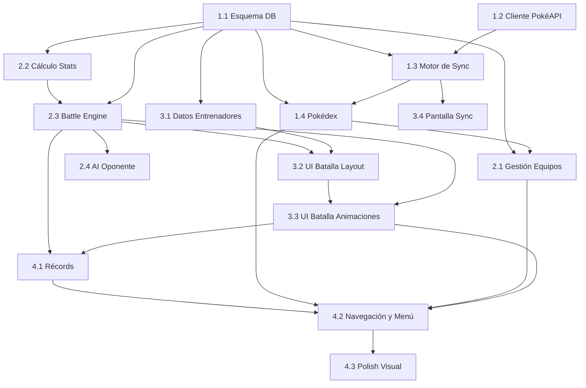

# Plan de Módulos - PokeAPI

## Visión General

El desarrollo se organiza en 4 fases que van de los cimientos de datos hasta el polish final. La lógica es simple: primero tener datos locales confiables, luego construir las mecánicas de juego sobre ellos, después conectar todo con UI de batalla, y finalmente pulir la experiencia.

| Fase | Enfoque | Duración Estimada |
|------|---------|-------------------|
| Fase 1 | Fundamentos — Datos y Sync | 5-6 días |
| Fase 2 | Core — Equipos y Motor de Batalla | 6-8 días |
| Fase 3 | Experiencia — UI de Batalla y Entrenadores | 5-7 días |
| Fase 4 | Polish — Récords, UX y Estética | 4-5 días |

**Total estimado: 20-26 días**

---

## Fase 1: Fundamentos — Datos y Sync

El objetivo de esta fase es tener toda la data de PokéAPI disponible localmente en Room, con sprites almacenados en disco. Al terminar esta fase, la app puede mostrar una Pokédex funcional sin conexión.

### Módulo 1.1: Esquema de Base de Datos Local

- **Descripción:** Definir todas las entidades Room, DAOs y la configuración de la base de datos. Este es el cimiento sobre el que se construye todo.
- **Entidades:** Pokemon, Move, PokemonMove, TypeEffectiveness
- **Funcionalidades:**
  - Entidades Room con anotaciones (@Entity, @PrimaryKey, @ForeignKey)
  - DAOs con queries de inserción bulk (upsert), consulta por ID, consulta paginada, búsqueda por nombre/tipo
  - RoomDatabase con las 4 entidades
  - TypeConverters para tipos complejos si se necesitan
- **Dependencias:** Ninguna
- **Criterios de completitud:**
  - La base de datos se crea sin errores en Android e iOS
  - Se pueden insertar y consultar registros de prueba en las 4 tablas
  - Los DAOs retornan Flow para observar cambios reactivamente

### Módulo 1.2: Cliente PokéAPI

- **Descripción:** Capa de networking con Ktor para consumir PokéAPI. Incluye los modelos de respuesta (DTOs), mappers a entidades locales y manejo de errores/rate limiting.
- **Entidades:** DTOs de API (PokemonResponse, MoveResponse, TypeResponse) + mappers
- **Funcionalidades:**
  - Configuración de Ktor Client con content negotiation (kotlinx.serialization) y logging
  - DTOs para cada endpoint: `/pokemon/{id}`, `/move/{id}`, `/type/{id}`
  - Mappers: DTO → Entity (separar modelo de red del modelo local)
  - Manejo de errores HTTP (retry con backoff, timeout)
  - Respeto de rate limiting (delay entre requests)
- **Dependencias:** Ninguna (no depende de Room, solo define los modelos y el client)
- **Criterios de completitud:**
  - Se puede hacer fetch de un Pokémon, un Move y un Type desde PokéAPI
  - Los DTOs deserializan correctamente la respuesta JSON
  - Los mappers producen entidades válidas para Room
  - Los errores de red se capturan y exponen de forma clara

### Módulo 1.3: Motor de Sync Inicial

- **Descripción:** Orquesta la descarga completa de datos desde PokéAPI y su persistencia en Room. Maneja progreso, errores parciales, y reanudación.
- **Entidades:** SyncStatus (tracking de progreso), usa Pokemon, Move, PokemonMove, TypeEffectiveness
- **Funcionalidades:**
  - Orquestador de sync que descarga en orden: Types → Moves → Pokémon (1-386) → PokemonMoves
  - Descarga y almacenamiento local de sprites (front_default) en filesystem
  - Tracking de progreso granular: porcentaje total + fase actual
  - Persistencia de estado de sync: si se interrumpe, retomar donde quedó
  - Filtrado de movimientos: solo moves con power > 0 y categoría physical/special
  - Tabla de TypeEffectiveness generada a partir de los datos de tipo
- **Dependencias:** Módulo 1.1, Módulo 1.2
- **Criterios de completitud:**
  - Sync completo de 386 Pokémon con sus datos, sprites y movimientos
  - El progreso se emite como Flow observable (porcentaje 0-100)
  - Si se cancela a mitad, al reiniciar retoma sin duplicar datos
  - Post-sync, toda la data es consultable offline desde Room
  - Sprites accesibles desde filesystem local

### Módulo 1.4: Pokédex — Listado y Detalle

- **Descripción:** Primera pantalla funcional. Lista de Pokémon con búsqueda/filtros y vista de detalle con stats, tipos y movimientos. Sirve como validación visual de que los datos están correctos.
- **Entidades:** Pokemon, Move, PokemonMove
- **Funcionalidades:**
  - Pantalla de lista: grid o lista de Pokémon con sprite, número, nombre y tipos
  - Búsqueda por nombre
  - Filtros por tipo y por generación (I, II, III)
  - Pantalla de detalle: sprite grande, stats en barras visuales, tipos, lista de movimientos aprendibles con tipo/poder/PP
  - Carga de sprites desde almacenamiento local (Coil)
  - Navegación lista ↔ detalle
- **Dependencias:** Módulo 1.1, Módulo 1.3 (datos disponibles)
- **Criterios de completitud:**
  - La lista muestra los 386 Pokémon con scroll fluido
  - La búsqueda filtra en tiempo real
  - Los filtros de tipo y generación funcionan correctamente
  - El detalle muestra stats, tipos y movimientos correctos
  - Los sprites se cargan desde local sin acceso a red

---

## Fase 2: Core — Equipos y Motor de Batalla

Con los datos locales disponibles, se construyen las dos mecánicas centrales: armar equipos y el engine de batalla (lógica pura, sin UI de batalla todavía).

### Módulo 2.1: Gestión de Equipos

- **Descripción:** CRUD completo de equipos. El jugador puede crear, editar, eliminar equipos y configurar cada Pokémon con nivel y movimientos.
- **Entidades:** Team, TeamMember
- **Funcionalidades:**
  - Pantalla "Mis Equipos": lista de equipos guardados con preview (sprites de los 6 Pokémon)
  - Crear nuevo equipo: nombrar + seleccionar slots
  - Selector de Pokémon: reutiliza la Pokédex con modo selección
  - Selector de movimientos: del pool del Pokémon elegido, seleccionar 1-4
  - Selector de nivel: slider 1-100, default 50
  - Validaciones: no repetir Pokémon, mínimo 1 en equipo, 1-4 moves por Pokémon
  - Editar equipo existente: cambiar Pokémon, movimientos, nivel, nombre
  - Eliminar equipo con confirmación
- **Dependencias:** Módulo 1.1, Módulo 1.4 (reutiliza Pokédex como selector)
- **Criterios de completitud:**
  - Se pueden crear, editar y eliminar equipos
  - Las validaciones impiden estados inválidos
  - Los equipos persisten entre sesiones
  - La selección de Pokémon y movimientos es fluida y clara

### Módulo 2.2: Cálculo de Stats

- **Descripción:** Módulo de lógica pura (sin UI) que calcula los stats reales de un Pokémon dado su base stats y nivel. Fórmula simplificada sin EVs/IVs/Nature.
- **Entidades:** Pokemon (base stats), TeamMember (nivel)
- **Funcionalidades:**
  - Fórmula de HP: `((2 * Base * Level) / 100) + Level + 10`
  - Fórmula de otros stats: `((2 * Base * Level) / 100) + 5`
  - Función que dado un Pokemon + Level retorna los 6 stats calculados
  - Unit tests exhaustivos comparando contra valores conocidos
- **Dependencias:** Módulo 1.1 (entidades)
- **Criterios de completitud:**
  - La función calcula correctamente para niveles 1, 50 y 100
  - Los valores son consistentes con la fórmula documentada
  - Tests unitarios pasan en todas las plataformas

### Módulo 2.3: Motor de Batalla (Battle Engine)

- **Descripción:** Lógica pura del sistema de batalla, completamente separada de UI. Es una state machine que recibe acciones y produce estados. Testeable de forma aislada.
- **Entidades:** BattleState, BattlePokemon, BattleAction, TurnResult
- **Funcionalidades:**
  - **BattleState:** estado completo de la batalla en cualquier momento (HP actual de cada Pokémon, PP restantes, Pokémon activo de cada lado, turno actual)
  - **BattlePokemon:** wrapper de un Pokémon en batalla con stats calculados, HP actual, PP actual por movimiento
  - **Cálculo de daño:** implementación de la fórmula `((2*Lvl/5+2) * Power * (Atk/Def)) / 50 + 2) * STAB * TypeEff * Random(0.85-1.0)`
  - **Resolución de turno:** ambos lados eligen acción → se ordena por priority del move y luego por Speed → se ejecutan secuencialmente
  - **STAB:** x1.5 si el tipo del movimiento coincide con algún tipo del atacante
  - **Type effectiveness:** producto de multiplicadores contra cada tipo del defensor (puede ser x0, x0.25, x0.5, x1, x2, x4)
  - **Accuracy check:** roll random contra accuracy del movimiento (si falla, el movimiento no conecta)
  - **Cambio de Pokémon:** consume turno, el oponente ataca al Pokémon que entra
  - **Faint:** cuando HP llega a 0, forzar selección de siguiente Pokémon
  - **Condición de fin:** un lado se queda sin Pokémon con HP > 0
  - **Historial de turnos:** registro de cada acción y resultado para replay/log
- **Dependencias:** Módulo 2.2 (cálculo de stats), Módulo 1.1 (TypeEffectiveness)
- **Criterios de completitud:**
  - Se puede simular una batalla completa programáticamente (sin UI)
  - El cálculo de daño produce valores dentro del rango esperado
  - STAB y type effectiveness se aplican correctamente
  - La batalla termina cuando un lado pierde todos sus Pokémon
  - Unit tests cubren: daño normal, super effective, not very effective, immune (x0), STAB, miss, faint, forced switch, battle end
  - El engine es determinista dado un seed de random (para testing)

### Módulo 2.4: AI del Oponente

- **Descripción:** Lógica de decisión de la CPU. Dada un BattleState, produce una BattleAction. Diferentes estrategias según dificultad del entrenador.
- **Entidades:** Trainer (ai_strategy), BattleState, BattleAction
- **Funcionalidades:**
  - **Estrategia básica (easy):** selecciona movimiento aleatorio entre los que tienen PP
  - **Estrategia moderada (medium):** prioriza movimientos super effective contra el Pokémon activo del jugador; si no tiene, usa el de mayor poder
  - **Estrategia avanzada (hard):** evalúa daño estimado de cada movimiento considerando STAB + type effectiveness y elige el óptimo; considera cambiar Pokémon si el actual tiene fuerte desventaja de tipo
  - Todas las estrategias filtran movimientos sin PP
  - Delay artificial en decisión para simular "pensamiento" (se aplica en UI, no en engine)
- **Dependencias:** Módulo 2.3 (BattleState, BattleAction)
- **Criterios de completitud:**
  - Cada estrategia produce acciones válidas en cualquier estado de batalla
  - La estrategia hard demuestra comportamiento notablemente más inteligente que easy
  - Unit tests verifican que nunca se selecciona un movimiento sin PP
  - La AI no tiene acceso a información oculta del jugador (no hace trampa)

---

## Fase 3: Experiencia — UI de Batalla y Entrenadores

El motor funciona. Ahora se viste con la interfaz retro y se crean los oponentes.

### Módulo 3.1: Datos de Entrenadores

- **Descripción:** Definición del contenido de juego: los entrenadores CPU con sus equipos, dificultad y organización en tiers/liga.
- **Entidades:** Trainer
- **Funcionalidades:**
  - Set de 15-20 entrenadores predefinidos organizados en tiers:
    - **Tier 1 (Novato):** 3-4 entrenadores con equipos de 3 Pokémon, nivel 20-30, estrategia easy
    - **Tier 2 (Intermedio):** 4-5 entrenadores con equipos de 4-5 Pokémon, nivel 40-50, estrategia medium
    - **Tier 3 (Avanzado):** 4-5 entrenadores con equipos de 6 Pokémon, nivel 60-70, estrategia medium
    - **Tier 4 (Élite):** 3-4 entrenadores con equipos de 6 Pokémon nivel 80-100, estrategia hard, equipos optimizados
  - Cada entrenador tiene tema: tipo favorito, región, o estrategia (stall, sweeper, balanced)
  - Datos hardcodeados o JSON local (no requiere sync)
  - Pantalla de selección de entrenador con sprite, nombre, dificultad y descripción
- **Dependencias:** Módulo 1.1 (referencia a Pokemon/Move)
- **Criterios de completitud:**
  - Todos los entrenadores son seleccionables
  - Los equipos de cada entrenador usan solo Pokémon/movimientos válidos del catálogo
  - La dificultad es perceptiblemente progresiva al jugar

### Módulo 3.2: UI de Batalla — Layout y HUD

- **Descripción:** La interfaz visual de la batalla: layout de pantalla, sprites de Pokémon, barras de HP, panel de acciones. Estética GBA pixel art.
- **Entidades:** BattleState (para renderizar)
- **Funcionalidades:**
  - **Layout de batalla estilo GBA:**
    - Pokémon del oponente: arriba-derecha, sprite frontal
    - Pokémon del jugador: abajo-izquierda, sprite trasero (o frontal espejado)
    - Barra de HP del oponente: arriba con nombre, nivel y barra coloreada (verde → amarillo → rojo)
    - Barra de HP del jugador: abajo con nombre, nivel, HP numérico y barra coloreada
  - **Panel de acciones (abajo):**
    - Estado default: caja de texto con narración ("¿Qué hará [Pokémon]?")
    - Opción Luchar: muestra 4 movimientos con tipo, PP restante
    - Opción Pokémon: muestra equipo con HP actual de cada uno
  - **Indicadores de tipo** en los movimientos
  - **Fondo de batalla** estilo GBA (plataformas/terreno pixelado)
- **Dependencias:** Módulo 2.3 (BattleState para datos), Módulo 3.1 (Trainer para sprites)
- **Criterios de completitud:**
  - El layout replica la disposición clásica de batalla GBA
  - Las barras de HP se actualizan reactivamente al cambiar BattleState
  - Los 4 movimientos se muestran con tipo y PP correctos
  - El panel de equipo muestra estado actual de cada Pokémon
  - La estética es consistentemente pixel art / retro

### Módulo 3.3: UI de Batalla — Animaciones y Flujo

- **Descripción:** Las transiciones, animaciones y el flujo narrativo que hacen que la batalla se sienta como un juego y no como una calculadora. El texto narrado, las animaciones de daño, los cambios de Pokémon.
- **Entidades:** TurnResult (para animar), BattleState
- **Funcionalidades:**
  - **Caja de texto narrativo** con efecto typewriter (letra por letra):
    - "[Pokémon] usó [Movimiento]!"
    - "¡Es super efectivo!" / "No es muy efectivo..." / "No afecta a [Pokémon]..."
    - "[Pokémon] se debilitó!"
    - "¡Ganaste contra [Entrenador]!" / "Has sido derrotado..."
  - **Animación de daño:** barra de HP baja gradualmente, sprite parpadea
  - **Animación de faint:** sprite cae/desvanece
  - **Transición de cambio:** sprite sale, nuevo sprite entra
  - **Pantalla de VS** al inicio con slide-in de entrenadores
  - **Pantalla de resultado** con resumen de batalla
  - **Control de flujo:** el jugador avanza el texto con tap, las acciones se bloquean durante animaciones
  - **Secuencia de turno completa:** narración de acción 1 → animación → narración de acción 2 → animación → check faints → siguiente turno
- **Dependencias:** Módulo 3.2 (layout base), Módulo 2.3 (TurnResult)
- **Criterios de completitud:**
  - Una batalla completa se puede jugar de inicio a fin con feedback visual y narrativo
  - El texto avanza con tap y no se puede skipear acciones (previene estados inconsistentes)
  - Las animaciones de daño y faint se ven claras
  - La pantalla de resultado muestra victoria/derrota y permite volver al menú

### Módulo 3.4: Pantalla de Sync Inicial

- **Descripción:** La primera pantalla que ve el usuario. Muestra progreso de descarga con estética retro temática.
- **Entidades:** SyncStatus
- **Funcionalidades:**
  - Pantalla fullscreen con fondo temático Pokémon retro
  - Barra de progreso pixelada con porcentaje
  - Texto de estado: "Descargando Pokémon... (Pokemon Pokemon)", "Descargando movimientos...", etc.
  - Animación o sprite decorativo mientras carga
  - Manejo de error: si falla, mensaje claro + botón reintentar
  - Al completar, transición al menú principal
- **Dependencias:** Módulo 1.3 (SyncStatus como Flow)
- **Criterios de completitud:**
  - El progreso se muestra en tiempo real
  - Si hay error de red, se muestra mensaje + opción de reintentar
  - Al completar, navega automáticamente al menú principal
  - La estética es consistente con el resto de la app

---

## Fase 4: Polish — Récords, UX y Estética

Todo funciona. Ahora se refina la experiencia, se añaden récords y se pule la estética retro.

### Módulo 4.1: Registro de Batallas y Récords

- **Descripción:** Persistencia de resultados y pantalla de estadísticas.
- **Entidades:** BattleRecord, PlayerStats
- **Funcionalidades:**
  - Guardar BattleRecord al finalizar cada batalla
  - Calcular y persistir PlayerStats: wins, losses, current streak, best streak
  - Pantalla de Récords:
    - Stats globales: W/L ratio, total batallas, mejor racha, racha actual
    - Historial cronológico: lista de batallas recientes con resultado, oponente, fecha
    - Stats por entrenador: veces enfrentado, veces ganado
  - Reset de estadísticas con confirmación
- **Dependencias:** Módulo 2.3 (resultado de batalla), Módulo 3.3 (integración post-batalla)
- **Criterios de completitud:**
  - Cada batalla completada genera un registro
  - Las estadísticas reflejan correctamente el historial
  - La racha se rompe con una derrota y se actualiza el best streak si corresponde
  - La pantalla muestra datos útiles sin abrumar

### Módulo 4.2: Navegación y Menú Principal

- **Descripción:** Estructura de navegación completa de la app y menú principal con estética retro.
- **Entidades:** Ninguna nueva
- **Funcionalidades:**
  - **Menú principal** con opciones: Batalla, Pokédex, Mis Equipos, Récords
  - Estilo menú retro GBA (cursor que se mueve entre opciones, sonido opcional)
  - Navegación con Navigation 3 + Adaptive Navigation
  - Deep linking entre secciones (ej: desde récord de batalla → detalle del entrenador)
  - Back navigation consistente en todas las pantallas
  - Splash screen con logo/título del juego
- **Dependencias:** Todos los módulos de UI previos
- **Criterios de completitud:**
  - Todas las secciones son accesibles desde el menú principal
  - La navegación es fluida y sin estados rotos
  - El back button funciona correctamente en todo el árbol de navegación
  - La estética del menú es consistente con el resto de la app

### Módulo 4.3: Polish Visual y Consistencia Retro

- **Descripción:** Pase final de estética. Asegurar que toda la app se siente cohesiva con la dirección GBA pixel art.
- **Entidades:** Ninguna
- **Funcionalidades:**
  - Implementar fuente pixel art consistente en toda la app
  - Revisar y unificar paleta de colores retro
  - Bordes, ventanas de diálogo y botones estilo GBA
  - Fondos pixelados para cada sección
  - Iconografía pixel art para tipos, menús y estados
  - Estados vacíos temáticos ("No tienes equipos aún", "Ninguna batalla registrada")
  - Estados de loading retro (Pokéball girando, etc.)
  - Estados de error con personalidad
  - Transiciones entre pantallas (fade, slide estilo GBA)
- **Dependencias:** Todos los módulos previos
- **Criterios de completitud:**
  - La app se siente como un producto cohesivo, no como pantallas sueltas
  - No hay componentes Material3 "crudos" sin estilizar
  - Los estados vacíos, loading y error están cubiertos en todas las pantallas
  - Un usuario reconocería inmediatamente la inspiración GBA

---

## Resumen de Dependencias

---

## Cronograma Sugerido

| Día | Módulos | Foco |
|-----|---------|------|
| 1-2 | 1.1 | Esquema Room completo con DAOs y tests |
| 3-4 | 1.2 | Cliente Ktor, DTOs, mappers |
| 5-7 | 1.3 | Motor de sync con progreso y persistencia de sprites |
| 8-9 | 1.4 | Pokédex: lista, búsqueda, filtros, detalle |
| 10-11 | 2.1 | CRUD de equipos con selección de Pokémon y movimientos |
| 12 | 2.2 | Cálculo de stats con tests |
| 13-15 | 2.3 | Battle engine completo con tests exhaustivos |
| 16 | 2.4 | AI de oponente (3 estrategias) |
| 17 | 3.1 | Definición de entrenadores + pantalla de selección |
| 18-19 | 3.2 | Layout de batalla GBA |
| 20-22 | 3.3 | Animaciones, texto narrativo, flujo completo de batalla |
| 22 | 3.4 | Pantalla de sync inicial |
| 23 | 4.1 | Récords y estadísticas |
| 24 | 4.2 | Menú principal y navegación completa |
| 25-26 | 4.3 | Polish visual, consistencia retro, estados vacíos/error/loading |
